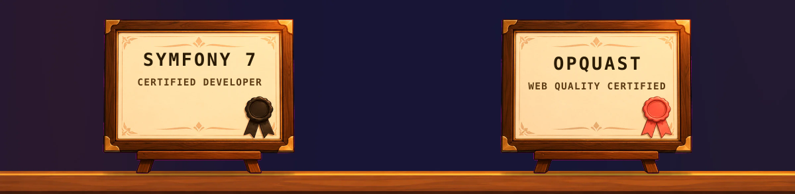
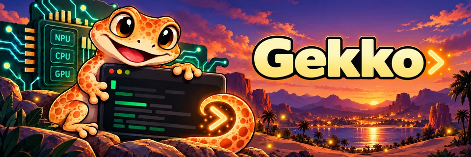
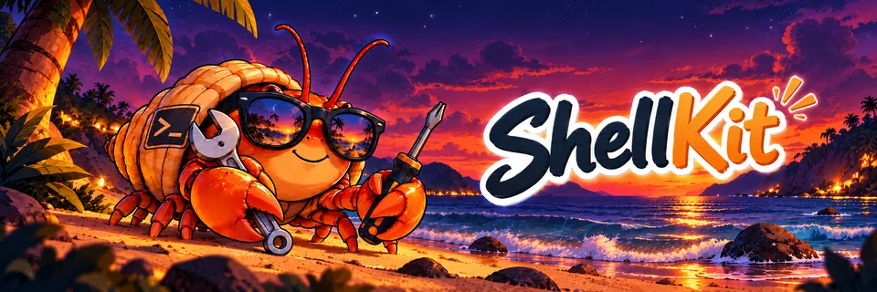
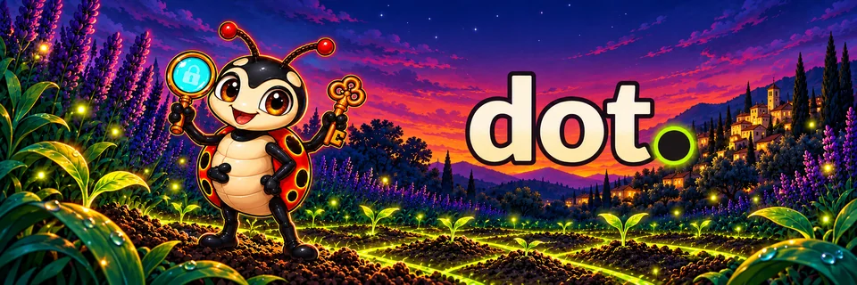

<picture>
  <source media="(prefers-reduced-motion: reduce)" srcset="assets/hero-static-dusk.webp">
  
</picture>

I'm a senior backend developer at **[NXP](https://www.fan-xp.com/fr/solutions/nextxp)**, based in Pont-Saint-Esprit, in the south of France. I mostly work with **PHP and Symfony**, and I still enjoy the frontend side of things.

I'm curious about a lot of things, and I like to dig into them until they click: local AI on NPUs, agentic coding, terminal ergonomics, web quality and accessibility. When something sticks, it usually ends up as a small open-source tool.

- 🛠️ Building backends with PHP and Symfony, and a lot of shell
- 🤖 Working with AI every day: Claude Code, agents, MCP and local models
- 🧭 Caring about web quality, accessibility and fast, boring software
- 🌐 More on **[franck.matsos.dev](https://franck.matsos.dev)**
- 💼 Let's connect on **[LinkedIn](https://www.linkedin.com/in/fmatsos)**

 

<table>
  <tr>
    <td width="33%" valign="top">
      
      <h3>🦎 <a href="https://github.com/fmatsos/gekko">gekko</a></h3>
    </td>
    <td width="33%" valign="top">
      
      <h3>🦀 <a href="https://github.com/fmatsos/shellkit">shellkit</a></h3>
    </td>
    <td width="33%" valign="top">
      
      <h3>🐞 <a href="https://github.com/fmatsos/dot">dot</a></h3>
    </td>
  </tr>
  <tr>
    <td valign="top">
      
<b>Your AI commands are configuration, not code.</b>

      
A generic Rust CLI engine that runs your own AI commands against any OpenAI-compatible model server. Commands are Markdown files, outputs are validated JSON, and every command is also an MCP tool.

    </td>
    <td valign="top">
      
<b>A plain zsh / bash setup that never makes you wait.</b>

      
An async, themeable prompt with per-project settings and plugins, driven by the <code>shkit</code> command. No framework: zsh starts in about 35 ms.

    </td>
    <td valign="top">
      
<b>One tool for all your dotfiles, without leaking a thing.</b>

      
One static binary to install and maintain your dotfiles profiles. It guards against leaks, reads secrets from your vault and merges MCP servers and settings for Claude Code, Codex and OpenCode.

    </td>
  </tr>
  <tr>
    <td valign="top">
      

        
        
        
      

    </td>
    <td valign="top">
      

        
        
        
      

    </td>
    <td valign="top">
      

        
        
        
      

    </td>
  </tr>
  <tr>
    <td valign="top">
      

        
        
        
      

    </td>
    <td valign="top">
      

        
        
        
      

    </td>
    <td valign="top">
      

        
      

    </td>
  </tr>
</table>

   
   
  

  

