<picture>
  <source media="(prefers-reduced-motion: reduce)" srcset="assets/banner-static.webp">
  
</picture>

  
  
  
  

## 👋 About me

I'm a senior backend developer at **[NXP](https://www.fan-xp.com/fr/solutions/nextxp)**, based in Pont-Saint-Esprit, in the south of France. I mostly work with **PHP and Symfony**, and I still enjoy the frontend side of things.

I'm curious about a lot of things, and I like to dig into them until they click: local AI on NPUs, agentic coding, terminal ergonomics, web quality and accessibility. When something sticks, it usually ends up as a small open-source tool.

- 🛠️ Building backends with PHP and Symfony, and a lot of shell
- 🤖 Working with AI every day: Claude Code, agents, MCP and local models
- 🧭 Caring about web quality, accessibility and fast, boring software
- 🌐 More on **[franck.matsos.dev](https://franck.matsos.dev)**

 

## 🎓 Certifications

  
  

## 🚀 Featured projects

<table>
  <tr>
    <td width="50%" valign="top">
      
      <h3>🦎 <a href="https://github.com/fmatsos/gekko">gekko</a></h3>
      
<b>Your AI commands are configuration, not code.</b>

      
A generic CLI engine, written in Rust, that runs your own AI commands against any OpenAI-compatible model server: OVMS on an Intel NPU, <code>llama-server</code> on Apple Silicon, and more. Commands are Markdown files, outputs are validated JSON, and every command is also an MCP tool.

      

        
        
        
      

      
<a href="https://fmatsos.github.io/gekko/"><b>Website</b></a> · <a href="https://fmatsos.github.io/gekko/docs/"><b>Docs</b></a> · <a href="https://github.com/fmatsos/gekko"><b>Repository</b></a>

    </td>
    <td width="50%" valign="top">
      
      <h3>🦀 <a href="https://github.com/fmatsos/shellkit">shellkit</a></h3>
      
<b>A plain zsh / bash setup that never makes you wait.</b>

      
An async, themeable prompt for Linux and macOS with per-project settings and plugins, all driven by the <code>shkit</code> command. No framework, no Oh My Zsh: zsh starts in about 35 ms and network data arrives in the background.

      

        
        
        
      

      
<a href="https://fmatsos.github.io/shellkit/"><b>Website</b></a> · <a href="https://fmatsos.github.io/shellkit/docs/"><b>Docs</b></a> · <a href="https://github.com/fmatsos/shellkit"><b>Repository</b></a>

    </td>
  </tr>
  <tr>
    <td width="50%" valign="top">
      
      <h3>🐞 <a href="https://github.com/fmatsos/dot">dot</a></h3>
      
<b>One tool for all your dotfiles, without leaking a thing.</b>

      
Installs and maintains one or more dotfiles profiles from a single static binary for Linux and macOS. It links the files in <code>~</code>, guards against leaks (forbidden terms, secrets), reads secrets from your vault, and merges MCP servers and settings for Claude Code, Codex and OpenCode.

      

        
        
        
      

      
<a href="https://github.com/fmatsos/dot"><b>Repository</b></a>

    </td>
  </tr>
</table>

## 🧰 Tech stack

| | |
|---|---|
| **Core** |     |
| **Daily setup** |    |
| **AI** |   |

…and a few other technologies, depending on the project.

   
  

